# 🐛Leftover Food

🥇 完成予定図([Figma](https://www.figma.com/file/m9iscoo0Cu5jttis27hZ3f/%E5%80%8B%E4%BA%BA%E6%83%85%E5%A0%B1%E3%81%8C%E3%81%A9%E3%82%8C%E3%81%A0%E3%81%91%E6%BC%8F%E6%B4%A9%E3%81%99%E3%82%8B%E3%81%8B%E3%83%81%E3%82%A7%E3%83%83%E3%82%AF%E3%81%99%E3%82%8B%E3%83%84%E3%83%BC%E3%83%AB?node-id=0%3A1))

## Execution Flow Design

```mermaid
sequenceDiagram
    participant API as 🌐 Dataset Serve API
    participant Front as 💻 Web Frontend
    actor User as User
    participant Inferer as 🤖 Inferer(offline)

    Front->>API: 📚 Give me a data set?
    API->>Front: 📚 Present for you!
    Note over API, Inferer: All further processing is offline.
    Front->>Front: ♻️ Rendering...
    User->>Front: 🗣 My public and secret information is this.
    User->>Front: 🗣 I use this Web service.
    Front->>Front: ♻️ Generating & Rendering...
    Front->>User: 🥳 This information will be leaked.
    Front->>Inferer: 👶 Can you infer that secret info?
    Inferer->>Front: 👶 Inference results.
    Front->>Front: ♻️ Rendering...
```

